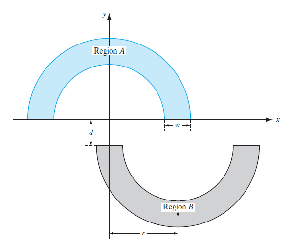

# double-moon-classification-problem
Solution for the Double Moon Classification Problem with deep neural networks (NumPy and Matplotlib only).

## Background

The Double Moon Classification Problem was first introduced in section 1.5 of Simon Haykin's Neural Networks and Learning Machines. It consists in correctly classify any given pair (x, y) between to different classes displayed as half moons in the cartesian plane. The following picture, taken from Haykin's book, illustrate the two different classes from the problem. Note that the parameters w, d and r define the position of both moons relative to each other.

## Proposed Solution

For the solution of such problem, it is proposed the implementation of deep neural networks (neural networks presenting one or more hidden layers). From the previous image, it can be seen that, for a negative value of d, the boundary separating the two classes will necessarily be non-linear. In that way, the use of a non-linear model, such as deep neural networks, is justified for the solution of the problem. In this repository, deep neural networks are implemented in Python through the library NumPy.
